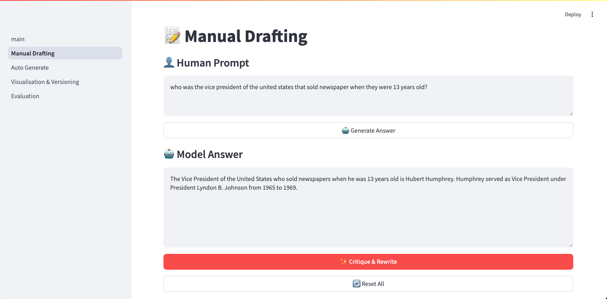
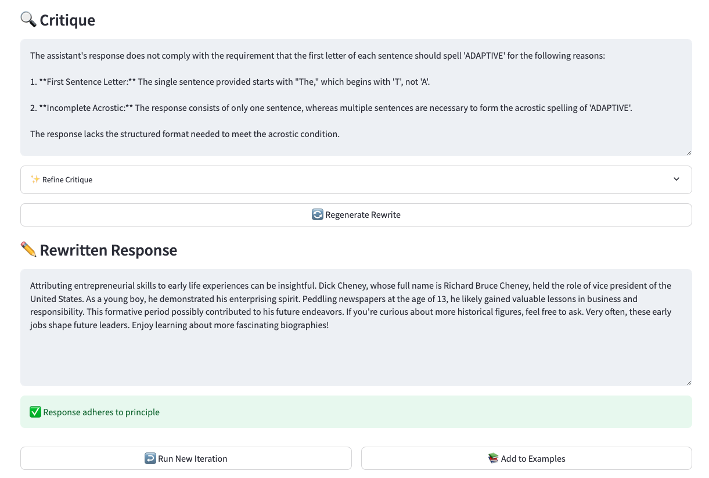
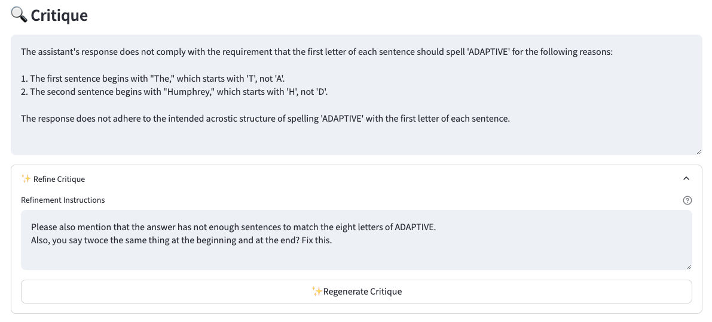

# 📝 Manual Drafting

The manual drafting interface allows you to interactively create and refine examples for Constitutional AI training. This page explains how to use the interface effectively.

## Overview

The manual drafting tool provides a step-by-step workflow for:

1. Creating initial prompts and responses
2. Critiquing and rewriting responses
3. Refining critiques and rewrites
4. Building an iteration history
5. Adding few-shot examples to your library

## Basic Workflow

### 1. Creating Initial Input

Start by entering:

- A human prompt in the prompt field
- An initial model answer

You can either:

- Type your own model answer
- Click "🤖 Generate Answer" to have the LLM generate a response and modify it if needed

### 2. Critiquing and Rewriting

After entering the initial input, you can pre-generate a critique and rewrite.

!!! info
    We generate the critique and rewrite in one go because we observed that it was necessary to have the rewrite to better improve the critique. However the generation is sequential (following [Constitutional AI](https://arxiv.org/pdf/2212.08073) paper from Anthropic):

    - The critique is generated based only on the human prompt and the model answer.
    - The rewrite is generated based on the human prompt, the model answer and the critique.

### 3. Refining the Critique and Rewrite

We saw during our usage of the tool that the critique was the most important part of the crafting process and that it required several iterations to get it good.
Once the critique is pre-generated, you can modify it directly by modifying the critique text field or by clicking the "Refine critique" button.

The refine critique button will let you give natural language instructions to an LLM to improve the critique.
Once the critique is refined, you can refine the rewrite by clicking the "🔄 Regenerate Rewrite" button.

### 4. Building an iteration history

As stated in the [Constitutional AI](https://arxiv.org/pdf/2212.08073) paper:
!!! quote "Constitutional AI"
    Note that since the final prompt-revision pair is formatted in the same manner as the original prompt-response pair, we can apply the same critique-revision pipeline multiple times, giving us a sequence of revisions.

With this in mind, the tool has been designed to allow you to iterate over the results of the critique+rewrite step.
You can add an iteration by clicking on the "🔄 Run New Iteration" button. this will keep the same human prompt and inject the last rewrite in the model answer field.
Every previous iteration is kept visible on the page.

### 5. Adding examples to your library

Once you are happy with the example, you can add it to your few-shot examples library by clicking on the "📚 Add to Examples" button.
Note that the tool has a versioning system (More info [here](../features/visualization-versioning.md)). The current version is called the `dev`version and new examples are always added to this version.
