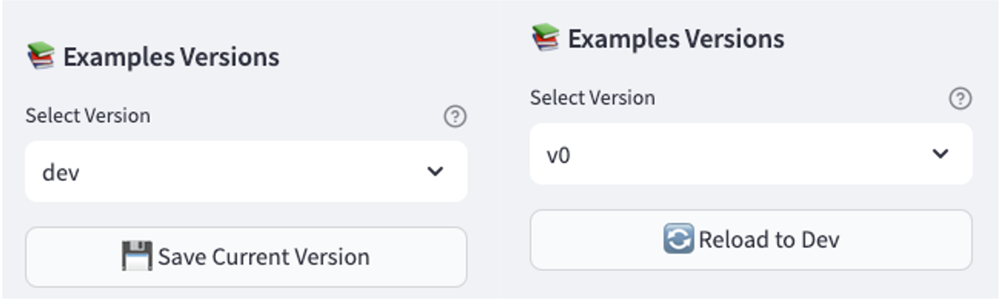

# 📊 Visualization & Versioning

The visualization and versioning interface allows you to manage, view, and analyze your examples across different versions. This page explains how to effectively use these features.

## Version Management

### Selecting Versions

At the top of the visualization page, you'll find version controls:

### Version Types

- `dev`: Development version for active work
- `v1`, `v2`: past versions or snapshots

### Actions on dev version

The dev version is the version that is currently being worked on.

- If the dev version is selected, you can see a "Save current version" button. that will create a new version with the current examples. This new version will automatically get the next available number.

- If an older saved version is selected, you can see a "Reload to dev" button. that will reload the dev version with the examples of the selected version.

    !!! Warning
        Be careful, this action will overwrite the current dev version with the examples of the selected version.

## Example Visualization

Each example in the selected version is displayed with:

- 📝 Human Prompt
- 🤖 Model Answer
- 🔍 Critique
- ✨ Rewrite
- ✅/❌ Adherence Status

The adherence status will allow you to very quickly see if all few-shot examples are compliant with the ADAPTIVE principle.

## Managing Examples

### Deleting Examples

Each example has a delete button that:

1. Removes the example from the current version
2. Updates the display immediately
3. Maintains version history

### Adding New Examples

Examples can be added to versions through:

- Manual drafting interface
- Auto-generate feature
- Direct file upload

## Next Steps

- Learn about [Auto Generate](auto-generate.md) features
- Understand [Evaluation](evaluation.md) metrics
- Explore [Manual Drafting](manual-drafting.md) techniques
